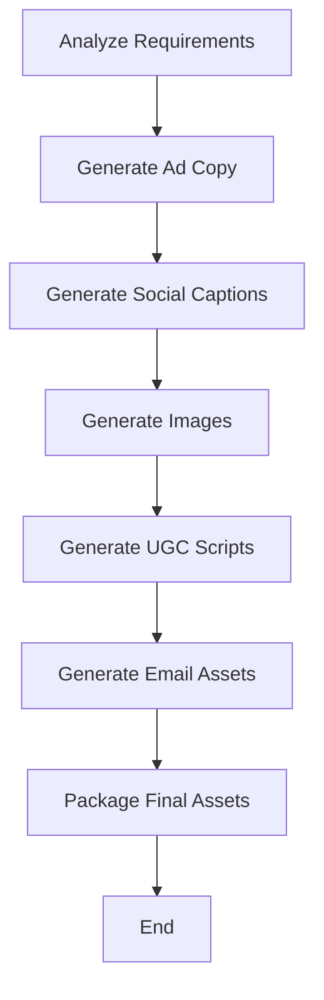

# 📄 content_generation_agent.py — Complete Explanation

This Python file defines an **automated content generation workflow** using LangGraph and modular content creation nodes. It is primarily used for **marketing automation** — generating ad copy, social media captions, images, video scripts, and email creatives based on inputs like product description, audience, tone, etc.

---

## 🔧 Key Components

### 1. `create_content_generation_graph()`
Creates a **LangGraph workflow** using a set of nodes (functions), each responsible for generating a part of the content.

Each node modifies a shared `state` dictionary with the generated output.

### 2. 🧠 Node Functions

#### `analyze_requirements_node(state)`
- Extracts content strategy including tone, colors, audience, and **pillars & key messages**.
- Calls:
  - `extract_content_pillars()`
  - `extract_key_messages()`

#### `generate_ad_copy_node(state)`
- If "ad_copy" is requested, calls `generate_ad_copy()` and stores result.

#### `generate_social_content_node(state)`
- If "social_captions" is requested, calls `generate_social_captions()`.

#### `generate_images_node(state)`
- If "static_images" or "product_visuals" are requested, calls `generate_static_images()`.

#### `generate_video_scripts_node(state)`
- If "ugc_scripts" is requested, calls `generate_ugc_scripts()`.

#### `generate_email_assets_node(state)`
- If "email_creative" is requested, calls `generate_email_assets()`.

#### `package_final_assets_node(state)`
- Packages all the content generated using `package_assets()`.

---

## 📈 Workflow Execution

### `run_content_generation_workflow(...)`
- Takes inputs: product_description, target_audience, content_types, tone, colors.
- Initializes the state, invokes the workflow, and returns final results.

---

## 🧩 Utility Functions

### `extract_content_pillars(product_description)`
- Returns up to 4 content themes based on keywords in the description (like innovation, quality, eco, etc).

### `extract_key_messages(product_description, target_audience)`
- Returns message snippets like "Saves time", "Premium quality", "Eco-friendly", etc.

### `validate_content_result(result)`
- Ensures at least one content field exists in final result.

---

## 🔁 LangGraph Flow Structure



---

## ✅ Example Output Structure

```json
{
  "timestamp": "...",
  "ad_copy": [...],
  "social_captions": {...},
  "images": [...],
  "ugc_scripts": [...],
  "email_assets": [...],
  "final_package": {...},
  "errors": []
}
```

---

## 💡 Summary

This script modularizes a full-fledged **AI-driven marketing content pipeline** using nodes and a DAG-like structure with LangGraph. It is easily extensible, debuggable, and integrates with custom generation tools like `generate_ad_copy`, `generate_static_images`, etc.